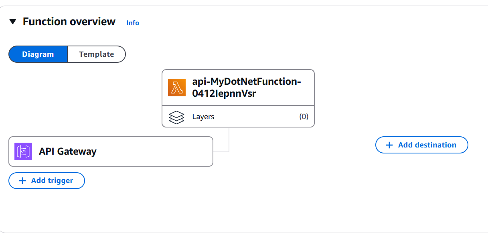
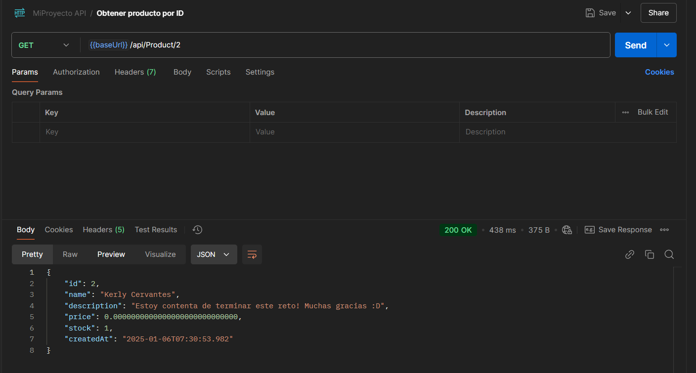

###  MiProyecto API

API desarrollada en .NET 8 para gestionar productos. Esta API permite realizar operaciones CRUD (Crear, Leer, Actualizar, Eliminar) sobre productos y está diseñada para ejecutarse localmente o como un servicio serverless en AWS utilizando API Gateway y Lambda.

Tabla de Contenidos

- Requisitos Previos
- Cómo Inicializar Localmente
- Despliegue en AWS Serverless
- Documentación de Endpoints


#### Requisitos Previos

1. NET SDK 8.0 instalado.
2. Docker (opcional para pruebas locales en contenedor).


Cómo Inicializar Localmente

##### Opción 1: Ejecución Directa

1. Clona el repositorio:

    ```
    git clone https://github.com/kercmari/cshart_serverless_lambda_product.git cd cshart_serverless_lambda_product
    ```

2. Restaura las dependencias y compila el proyecto:

    ```
    dotnet restore dotnet build
    ```
3. Ejecuta la API:

    ```
    dotnet run --project MiProyecto
    ```


##### Opción 2: Usar Docker

1. Construye y ejecuta el contenedor con Docker:

    ```
    docker-compose up --build
    ```

La API estará disponible en:

- Base URL: `http://localhost:5227`
- Documentación Swagger: `http://localhost:5227/swagger`

#### Endpoints

Base URL

- Local: `http://localhost:5227/api/Product`
- Despliegue en AWS: `https://jiea20ag80.execute-api.us-east-1.amazonaws.com/api/Product`

Endpoints

1. Obtener Producto por ID
    - Descripción: Devuelve un producto específico por su ID.
    - Método: GET
    - URL: /api/Product/{id}
    - Respuesta Exitosa (200):
        ```json
        { "id": 1, "name": "Producto 1", "description": "Descripción del producto", "price": 19.99, "stock": 50 }
        ```
    -  Respuesta No Encontrada (404):
        ```json
        { "message": "Producto no encontrado." }
        ```
2. Obtener Todos los Productos

    - Descripción: Devuelve una lista de todos los productos.
    - Método: GET
    - URL: /api/Product
    - Respuesta Exitosa (200)
        ```json 
        [ { "id": 1, "name": "Producto 1", "description": "Descripción del producto", "price": 19.99, "stock": 50 }, { "id": 2, "name": "Producto 2", "description": "Otro producto", "price": 29.99, "stock": 30 } ]

3. Crear un Producto

    - Descripción: Crea un nuevo producto.
    - Método: POST
    - URL: /api/Product
    - Cuerpo de la Solicitud:
        ```json
        { "name": "Producto Nuevo", "description": "Descripción del producto", "price": 19.99, "stock": 100 }
        ```

    - Respuesta Exitosa (201):
        ```json
        { "id": 3, "name": "Producto Nuevo", "description": "Descripción del producto", "price": 19.99, "stock": 100 }
        ```


4. Actualizar un Producto

    - Descripción: Actualiza la información de un producto existente.
    - Método: PUT
    - URL: /api/Product/{id}
    - Cuerpo de la Solicitud:
        ```json
        { "name": "Producto Actualizado", "description": "Descripción actualizada", "price": 29.99, "stock": 50 }
        ```

    - Respuesta Exitosa (200):
        ```json
        { "message": "Producto actualizado exitosamente.", "existingProduct": { "id": 1, "name": "Producto Actualizado", "description": "Descripción actualizada", "price": 29.99, "stock": 50 } }
    ```

5. Eliminar un Producto
    - Descripción: Elimina un producto por su ID.
    - Método: DELETE
    - URL: /api/Product/{id}
    - Respuesta Exitosa (200):

        ```json 
        { "message": "Producto eliminado exitosamente.", "product": { "id": 1, "name": "Producto Eliminado" } }
        ```


#### Despliegue en AWS Serverless

La API se encuentra desplegada como un servicio serverless en AWS Lambda utilizando API Gateway. Puedes acceder a la API y su documentación interactiva Swagger en:

- Base URL: `https://jiea20ag80.execute-api.us-east-1.amazonaws.com`
- Swagger: `https://jiea20ag80.execute-api.us-east-1.amazonaws.com/swagger/index.html`

Infraestructura Utilizada

- API Gateway: Maneja las solicitudes HTTP y redirige a AWS Lambda.
- AWS Lambda: Ejecuta la lógica de la API en .NET 8.
-almacenamiento adicional, puede integrarse fácilmente.

- 

> [!NOTE]  
> Hay un archivo collections.json para importar en postman y hacer pruebas del servicio despelgado




### Ejecutar migracion 
> dotnet ef migrations add InitialMigration --project ./Infrastructure/Infrastructure.csproj --startup-project ./MiProyecto/Api.csproj
> dotnet ef database update --project ./Infrastructure/Infrastructure.csproj --startup-project ./MiProyecto/Api.csproj

